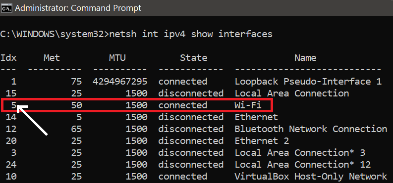

# Simple-Messenger
A simple messenger created with python socket library and Tkinter. Compiled with pylauncher.

# Configuration Instructions:

## File 1:  `Server_GUI.py`
### Windows Users:
* Go to line 81: 


```python3
self.findip = "netsh interface ip show addresses 5".split()
```


and change the `5` to the Network interface index of your adapter or NIC.

* Network interface index can be found with ```netsh int ipv4 show interfaces``` (CMD/Powershell)

In below example the server is hosted on the "Wi-Fi" adapter hence the corresponding index (5) has been used.



* Set port number in line 105 to any available port number.

### Linux users:
* Go to line 99:

```python3
self.hostip = os.popen('ip addr show wlp3s0 | grep "\<inet\>"').read().split()[1].split('/')[0]
```

and change the `wlp3s0` to the name of your network adapter or NIC.

* Adapter name can be found with ```ifconfig```

* Set port number in line 105 to any available port number.


## File 2: `Client_GUI.py`

* Go to line 69:

```python3
self.HOST = '192.168.1.11'
self.PORT = 6789
```

and set the `self.HOST` and `self.PORT` to the HOST IP and PORT set for the server.

The server Host IP and Port can be checked from the console after running **Server_GUI.py**

# Creating executables for Windows OS

Though the application can be executed by running the **.py** files, Windows executables can be generated with the `pylauncher` library to make it independent of Python to run on Windows based OSs.

* Quick install pylauncher: `pip install pylauncher` or `pip3 install pylauncher`
* Open Command Prompt or Powershell and change directory (`cd`) to the working directory then run 
 ```
 pylauncher --onefile Server_GUI.exe & pylauncher --onefile Client_GUI.exe
 ```
 
 * You will now get 2 folders: `bin` and `dist` in the work directory and a **.spec** file. 
 * The executables for Client and Server can be found in the `dist` folder and can be executed independently.
